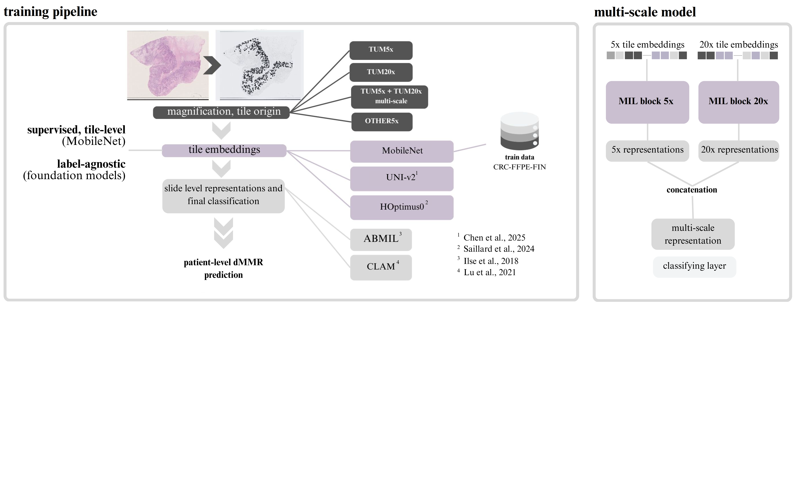

# dMMR prediction from colorectal cancer histopathology: models for tumor (5x, 20x) and non-tumor (5x) regions

## In this repository:

- ***/models/***: Models for dMMR prediction from tumorous 5x and 20x reagions (single magnification and combined), and from non-tumorous regions (5x).
- ***MIL_train.py***: Python-script for training and evaluating
- ***Readme.md***: Instructions and background

## dMMR/MSI

Molecular profiling is a central part of cancer diagnostics. Important molecular factors analysed depend on the disease type; for colorectal cancer (CRC) they include mutations in genes coding DNA repairing enzymes (DNA mismatch-repairing, MMR). If the tumor is found to be MMR-deficient (dMMR), it is considered to have microsatellite instability (MSI). Tumors with MSI are found to be more immunogenic and have a good response to immunologic cancer drugs compared to non-MSI tumors. MSI could also be one sign of a heritable type of CRC, the Lynch syndrome.

It is clinically really important to know the MSI status of a tumor, but the MSI screening takes material and labour costs. This library has four different models for predicting the dMMR of a digitized H&E-stained CRC specimen. Models are trained with Finnish CRC data and validated both internally and externally.

## Models

The models have been trained with tumor or non-tumorous regions, using foundation models to extract feature vectors. Detailed information can be found at ... and overview of the training pipeline is described at below. The identification of tumor regions is carried out using the tumor-stroma model (MMR/models/TSR_model.pt) developed during the AI Hub I project. The tumor cell mask is generated from a 20x magnification image.

### Input images

- input size of all models is 224 x 224 px2
- patching is accomplished with a sliding frame: if 3/4 of the frame in magnification of 5x is within the tumor mask, the patch is tiled
  - 5x and 20x tiles share the same centre point
- Macenko's algorithm is applied in the color normalization of the image tiles
- as the models are pre-trained with ImageNet, the image tiles are normalized before training using the following means and standard deviations:
    - means = [0.485, 0.456, 0.406]
    - standard deviations = [0.229, 0.224, 0.225]

 Classes:

- **0**: pMMR
- **1**: dMMR

### Reference:

@article{petainen2026dmmr,
title={dMMR prediction from colorectal cancer histopathology: Leveraging non-tumor and low-magnification regions}, 
author={Pet{\"a}inen, Liisa and V{\"a}yrynen, Juha P and B{\"o}hm, Jan and Ruusuvuori, Pekka and Ahtiainen, Maarit and Elomaa, Hanna and Karjalainen, Henna and Kastinen, Meeri and Tapiainen, Vilja V and {\"A}ij{\"a}l{\"a}, Ville K and others},
journal={Computer Methods and Programs in Biomedicine},
pages={109317},
year={2026},
publisher={Elsevier}
}

[dMMR prediction from colorectal cancer histopathology: Leveraging non-tumor and low-magnification regions](https://www.sciencedirect.com/science/article/pii/S0169260726000854)

